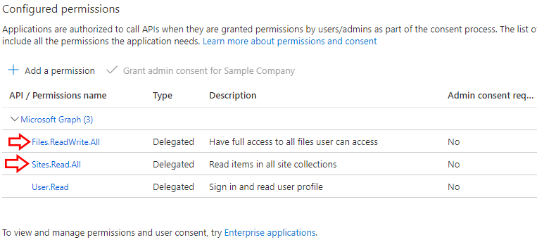
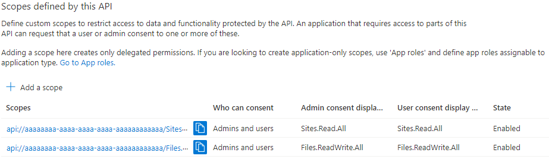
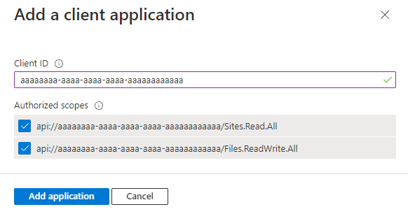

# python-sharepoint-file-manager
A few scripts that can download and upload files to SharePoint/OneDrive/Teams.

### Table of Contents
- [Overview](#overview)
- [Required Script Setup](#required-script-setup)
- [Setup Microsoft Azure AD App](#setup-microsoft-azure-ad-app)
- [Finding Your Drive ID](#finding-your-drive-id)
- [Finding Your Folder Path](#finding-your-folder-path)
- [Acquiring an MFA Secret](#acquiring-an-mfa-secret)
- [Python Package Installation](#python-package-installation)
- [Firefox & Geckodriver Setup](#firefox---geckodriver-setup)
- [Common Questions & Issues](#common-questions---issues)

## Overview
These Python scripts allow you to download or upload files to a SharePoint/OneDrive/Teams drive that an account has access to.  To achieve this, the script primarily uses Microsoft Graph API, the Microsoft Authentication Library (msal), Firefox (the web browser), and Selenium along with a few other Python libraries.  The script is ran simply by running `python3 sharepoint_downloader.py` for the download, and `python3 sharepoint_uploader.py` for the upload.

> **Note**: Any time I mention the `sharepoint_downloader.py` script in the tutorial, the same also applies to `sharepoint_uploader.py`

This script optionally offers numerous flags/arguments you can add to the end of the script to change how it will run.  To view the general help page for these arguments, add the flag `-h` or `--help` to the end of the script (like so: `python3 sharepoint_downloader.py -h` or `--help`).  For more information on these runtime arguments, expand the section below.

<details>
  <summary><b>Runtime Arguments</b></summary>
  
  - If you wish to run the script on an account that doesn't have MFA enabled, you can add the flag `-N` or `--nomfa` to the end of the script.  If you don't add the flag while not having MFA setup, the script will first complain about the empty MFA_SECRET variable, and if you fake the secret, it will then hang and crash where you would enter in your six-digit MFA code.  By default, this script assumes that MFA will be setup during the script configuration process.  
  
  - If you want to see the Selenium browser automation that is being done (or need it for some bugfixing), you can add the flag `-G` or `--gui` to the end of the script to have Firefox launch with a GUI instead of being headless.
  
  - Lastly, there is an option to attempt to find your `M365_DRIVE_ID` variable by running the script with the `-D` or `--driveid` flag.  More details on this drive ID flag can be found in the second half of the [Finding Your Drive ID section](#finding-your-drive-id).  You can also run all three of these flags at the same time if you wish to do so.
</details>

This script requires a decent amount of pre-configuration before it will work, with this [File Handling in SharePoint with Python](https://python.plainenglish.io/all-you-need-to-know-file-handing-in-sharepoint-using-python-df43fde60813) tutorial being the main inspiration for this script.  However, I had a few issues following this tutorial (no information on drive_id's and token generation didn't work with MFA), so a full setup tutorial for this script is included below.

> **Note**: Some of the images may look a bit compressed due to resizing them to fit the narrow GitHub README column, so if you have any issues seeing anything, you can click on the image to enlarge them.

Lastly, if you want to get the six-digit MFA code that you need during setup without using an app on your phone, the [mfa_code_generator.py](mfa_code_generator.py) file can generate your six-digit code and tell you how many more seconds it is valid for.  All you need is the MFA_SECRET variable filled out in your `msal_config.env` file.

## Required Script Setup
Most of the setup for this script will eventually be entered into a `msal_config.env` file with the following variables as seen below and also in [sample.env](sample.env):
```
CLIENT_ID =         "aaaaaaaa-aaaa-aaaa-aaaa-aaaaaaaaaaaa"
AUTHORITY_URL =     "https://login.microsoftonline.com/cccccccc-cccc-cccc-cccc-cccccccccccc"
M365_DRIVE_ID =     "##################Ml0MFG46i5yVcjFFrjNUDOU7RZgloc7UUnFE############"
M365_FOLDER_PATH =  "Network Operations/On-Call & Scheduled Work"
M365_FILENAME =     "NetOps Work Tracker.xlsx"
MFA_SECRET =        "2w2h5q6ztwbb75rx"
M365_USERNAME =     "user@example.com"
M365_PASSWORD =     "hunter2"
```
Without all these variables filled out, ***the script will not work*** (unless you use certain runtime arguments).  You will need to create the `msal_config.env` file as one of the first things during setup.  You can either do this manually or run sharepoint_downloader.py without a `msal_config.env` file in your script's directory, and the script will detect that you are missing the file and ask if you want to make a blank `msal_config.env` file.

If any of your variables in `msal_config.env` are not filled out or are very obviously wrong, the script will report which variables are blank/wrong, and then exit the script.  I will explicitly mention the variables in the tutorial when they appear, so just remember that they will need to be eventually filled out and that the script will not work unless all eight variables are filled out.

## Setup Microsoft Azure AD App
First, an app in Microsoft Azure AD is required.  This app is what will be giving this script permission to view and download files from your Microsoft 365 account.  To start this process, head over to the [Azure Portal](https://portal.azure.com/) and login into your account.  After logging in, click on the <ins>**Azure Active Directory**</ins> button.

<p align="center"></p>

After entering Azure Active Directory, select <ins>**App registrations**</ins> and then <ins>**New registration**</ins> to begin the app creation process.

<p align="center"></p>

Next, you must give the app a name and select <ins>**Accounts in this organizational directory only ({Tenant Name} only - Single tenant)**</ins> as you are downloading files from the same organizational directory this app is in.  This essentially means you will only be able to download files from within your organization.  I think you may be able to select the multitenant option, but this will open your API permissions to ***ANY*** Microsoft 365 account, look at the [Common Questions & Issues](#common-questions--issues) for a more detailed discussion of single vs multitenant apps.

Finally, at the bottom of the page is the most important step in this guide.  For the Redirect URI, select <ins>**Public client/native (mobile & desktop)**</ins> from the drop-down list and type in `http://localhost:9999/tokenCallback`.  The script ***WILL NOT WORK*** if the redirect URI platform configuration is set to anything but Public client/native (mobile & desktop).  If you already have an application on port 9999, look at the [Common Questions & Issues](#common-questions--issues) for a fix.

The reason behind these selections is that mobile & desktop are the only platform type that allows custom redirect URIs, and the redirect points to a non-existent localhost server in order to substring the end of the URL which will have authentication variables.  Look at [loginProcess()](core/token_generator.py#L91) and [createAuthResponseDict()](core/token_generator.py#L186) if you want to know more about the specifics.

<p align="center"></p>

After registering your app, you will be brought to the app overview page which will have two credentials that are needed in `msal_config.env`, the <ins>**Application/Client ID**</ins> and the <ins>**Tenant ID**</ins>.  Copy the <ins>**Application/Client ID**</ins> to the `CLIENT_ID` variable and copy the <ins>**Tenant ID**</ins> to the end of <ins>`https://login.microsoftonline.com/{tenant_id}`</ins> for the `AUTHORITY_URL` variable.

<p align="center"></p>

Next, you need to add the API permissions needed to download files from a SharePoint/OneDrive/Teams site.  These permissions are called "scopes" and I will be referring to them as such henceforth.  You may notice that the `User.Read` scope is already added to your new app.  You can remove it if you want, but it doesn't hurt to have it either.  In order to start adding a new scope, first select the <ins>**API permissions**</ins> menu selection and then click the <ins>**Add a permission**</ins> button.

<p align="center"></p>

Once there, select the <ins>**Microsoft Graph**</ins> button.  As you can see, there are other APIs one could use for other scripts, but for this script, we will be using Microsoft Graph.

<p align="center"></p>

Next, select the <ins>**Delegated permissions**</ins> button as we will be signing into a user's account for this script.

<p align="center"></p>

Afterwards, search for <ins>**sites**</ins> and add the <ins>**Sites.Read.All**</ins> scope to the app.

<p align="center"></p>

Do the same again and search for <ins>**files**</ins> and add the <ins>**Files.ReadWrite.All**</ins> scope to the app.

<p align="center"></p>

If you have done this correctly you should have something that looks like the image below.  Make sure you have both <ins>**Sites.Read.All**</ins> and <ins>**Files.ReadWrite.All**</ins> as configured scopes.  Sites are the top-level objects in SharePoint/OneDrive/Teams drives, and the file scope allows you to download and upload files within those sites.

<p align="center"></p>

Next, you need to Expose an API.  This is what specifies the scopes within the access token that is used for authentication.  Before the API performs a call, it checks to see what scopes are within the token, and if the scopes are missing, the API will refuse to perform the requested operation.  In order to add these scopes, first select the <ins>**Expose an API**</ins> menu selection and click the <ins>**Add a Scope**</ins> button.

<p align="center"></p>

You will then be asked to set an <ins>**Application ID URI**</ins>.  It should autocomplete with your Client ID, so after confirming that it is correct, select Save.

<p align="center"></p>

Next, you will need to type in the scope name exactly the same as it is displayed.  Keep all capitals the same and don't add any spaces before, in, or after the scope name.  Specifically, we will be adding the <ins>**Sites.Read.All**</ins> and the <ins>**Files.ReadWrite.All**</ins> scopes we just defined.

First enter in <ins>**Sites.Read.All**</ins> for the Scope name.  After entering the scope name select <ins>**Admins and users**</ins> under the Who can consent section.  Next, add a consent display name and description for both the admin and the user.  These can really be anything you want, but it would be useful to give a brief name and description for each scope.  Finally, make sure you select the <ins>**Enabled**</ins> state at the bottom and finally click <ins>**Add Scope**</ins>.  Repeat all of these steps for the <ins>**Files.ReadWrite.All**</ins> scope as well.

<p align="center"></p>

After adding these scopes, you should see them both in the Scopes defined by this API section, as seen below.

<p align="center"></p>

Finally, select the <ins>**Add a client application**</ins> button under the Authorized client applications section.  Click the checkboxes for the two <ins>**Sites.Read.All**</ins> and <ins>**Files.ReadWrite.All**</ins> scopes you just exposed and select <ins>**Add application**</ins>.

<p align="center"></p>

If you have done everything correctly so far, your Expose an API screen should look similar to the screenshot below, and you should have your `CLIENT_ID` and `AUTHORITY_URL` variables entered in your `msal_config.env` file.

<p align="center"></p>

## Finding Your Drive ID
Finding your drive_id is what made me initially start writing this script, as the tutorial linked at the start mentions drive_id's, but never tells you how to find them.  Additionally, the only Microsoft response I could find on some Power Automate forum has this super roundabout way of getting your drive_id, so I managed to find two solutions, one using Microsoft's Graph Explorer and one using the `sharepoint_downloader.py` python script.

Make sure to do two things before you start attempting to find your drive_id.
- Firstly, make sure you have recently opened whatever file you want to download in SharePoint/OneDrive/Teams.
- Secondly, open up the file you wish to download and share it with the account that will be used in this script.

Both the script method and the Microsoft Graph Explorer method can look at recently opened files to find your drive_id or can look through all files that are shared with your account to find your drive_id.  The python script method will attempt both of these automatically, while the Microsoft Graph Explorer method will require a few extra clicks to perform both.

The first method here is the Graph Explorer method, which is a bit more user friendly compared to the script method.  To start, you first need to browse to Microsoft's [Graph Explorer](https://developer.microsoft.com/en-us/graph/graph-explorer) website and sign in to your account in the top right.  This website lets you run sample Microsoft Graph API calls on your actual account as both a development and testing tool.

After logging in, first click on <ins>**Resources**</ins> on the top left side of the page.  Next, scroll down to the drive (not drives, they are different) resource and select the <ins>**microsoft.graph.recent()**</ins> API query.  Finally, click <ins>**Run query**</ins> in the top right.

<p align="center"></p>

After running the query, you should get a giant JSON response at the bottom of the page.

First, you will be looking for the value of one of the `name` keys to match the filename you are looking for.  After finding that key-value pair, scroll down until you see the `remoteItem` key.  Within all those values should be another key-value pair for `parentReference`.  Lastly, within the `parentReference` values should be a key `driveId`, which will have the value of your drive_id that you are looking for.

Overall, your JSON query would look something like this `["value"][i]["remoteItem"]["parentReference"]["driveId"]` with the `i` representing each item you've recently viewed.  Copy this `driveId` value to the `M365_DRIVE_ID` variable in your `msal_config.env` file.

<p align="center"></p>

If that didn't work, go back to <ins>**Sample Queries**</ins>, search for <ins>**shared**</ins> in the search bar, select the <ins>**OneDrive files shared with me**</ins> resource, and click <ins>**Run query**</ins>.

<p align="center"></p>

Then just like before, you get a giant JSON response at the bottom of the page.  Follow the same `["value"][i]["remoteItem"]["parentReference"]["driveId"]` path that you followed before to find your `M365_DRIVE_ID` variable.  Below is an example of finding the driveId variable for a shared word doc named "Dummy Test File.docx".

<p align="center"></p>

If for some reason you are unable to access the Graph Explorer app in your organization, but do still have the Sites.Read.All and Files.ReadWrite.All scopes, you can instead perform the two API calls through the script.  This second solution using the script requires you to jump ahead a bit and download all the python packages, which is outlined in the [Python Package Installation step here](#python-package-installation).  Additionally, if you will be using MFA, you will also need to follow the steps for [Acquiring an MFA Secret here](#acquiring-an-mfa-secret).  After downloading all the python packages and setting up MFA if needed, make sure `CLIENT_ID`, `AUTHORITY_URL`, `MFA_SECRET` (if used), `M365_USERNAME`, and `M365_PASSWORD` are filled out.

Next, run the sharepoint_downloader.py script with either the `-D` or `--driveid` flags (like so: `python3 sharepoint_downloader.py -D` or `python3 sharepoint_downloader.py --driveid`).  The script will take about a minute to generate a token and then perform the exact same two Microsoft Graph API calls I outlined above, one for recently viewed files and one for files shared with you.

If your JSON output looks similar to one of the two images above, then all you need to do is follow the `["value"][i]["remoteItem"]["parentReference"]["driveId"]` path to find your `M365_DRIVE_ID` variable.  I would highly recommend copy-pasting the output into some sort of online JSON formatter for easier viewing.

After completing this step, you should have three variables filled out in your `msal_config.env` file; `CLIENT_ID`, `AUTHORITY_URL`, and `M365_DRIVE_ID`.  If you ended up needing to use the script method to generate your drive_id, then you can skip the steps below you already had to follow.

## Finding Your Folder Path
In this section you will be setting your `M365_FOLDER_PATH` and `M365_FILENAME` variables.  This section is rather simple but can be easy to mess up.

First, navigate to the file you wish to download in SharePoint/OneDrive/Teams or the folder you want to upload to and look at the document path.

The first top-level folder all SharePoint/OneDrive/Teams drives have is "Documents".  ***DO NOT*** include Documents as part of your folder path and ***DO NOT*** start or end the folder path with a forward slash "/".  Everything after Documents until the actual file itself becomes your `M365_FOLDER_PATH`.

The `M365_FILENAME` variable is the name of the file on SharePoint/OneDrive/Teams in that folder that you want to download, or the name of the local file you wish to upload to that folder.  Let me run through three examples below.

This first example would be if you wanted to download some text file within your Teams General folder called test.txt.  Your `M365_FOLDER_PATH` variable would be set to `"General"` and your `M365_FILENAME` variable would be `"test.txt"` to download the file shown below.

<p align="center"></p>

This second example is what is shown in sample.env.  This is a case where you want to download a file called NetOps Work Tracker.xlsx that is numerous subdirectories deep.  Your `M365_FOLDER_PATH` variable would be set to `"Network Operations/On-Call & Scheduled Work"` and your `M365_FILENAME` variable would be `"NetOps Work Tracker.xlsx"` to download the file shown below.

<p align="center"></p>

For this third example, let's say we wanted to upload a file named `upload test.txt` to the same directory that we used in the second example.  To do this, first make sure your file you want to upload is in the same directory as the script.  Next, set your `M365_FOLDER_PATH` variable to `"Network Operations/On-Call & Scheduled Work"` and your `M365_FILENAME` variable would be `"upload test.txt"` to upload the file to the folder above.

After completing this step, you should have five variables filled out in your `msal_config.env` file; `CLIENT_ID`, `AUTHORITY_URL`, `M365_DRIVE_ID`, `M365_FOLDER_PATH`, and `M365_FILENAME`.

## Acquiring an MFA Secret
The last major setup needed for your `msal_config.env` file is acquiring an MFA secret for your account.  We want to use the MFA secret generated and used for general authenticator apps, but since Microsoft wants you by default to use Microsoft Authenticator, we need to take a few extra steps to get that secret.

First, login to the [Microsoft Account Settings](https://myaccount.microsoft.com/) page and select <ins>**UPDATE INFO**</ins> in the Security info section.

<p align="center"></p>

Next, select <ins>**Add sign-in method**</ins>.

<p align="center"></p>

Select <ins>**Authenticator app**</ins> as the method you would like to add.

<p align="center"></p>

Click the <ins>**I want to use a different authenticator app**</ins> link.  After clicking this link, you will be asked to add a new account in your authenticator app of choice, which you can click right through as it doesn't matter for this script.

<p align="center"></p>

Next, click the <ins>**Can't scan image?**</ins> button and you will finally see your MFA secret key.  Copy this secret key into the `MFA_SECRET` variable in your `msal_config.env` file.

<p align="center"></p>

You will then be asked to enter the six-digit MFA code that correlates to your MFA secret.  You can either scan the QR code provided or run the [mfa_code_generator.py](mfa_code_generator.py) script to get those six digits and click Next.

<p align="center"></p>

Finally, make sure your default sign-in method is set to the newly created <ins>**Authenticator app or hardware token - code**</ins> setting.  This makes your default login use the six-digit MFA code instead of an app notification or texting a number.  The script will not work if any other MFA method is selected for the default sign-in.

<p align="center"></p>

After completing this last step, you should have six variables filled out in your `msal_config.env` file; `CLIENT_ID`, `AUTHORITY_URL`, `M365_DRIVE_ID`, `M365_FOLDER_PATH`, `M365_FILENAME`, and `MFA_SECRET`.

Your last two variables `M365_USERNAME` and `M365_PASSWORD` don't require any fancy setup and are pretty self explanatory.  `M365_USERNAME` and `M365_PASSWORD` are the username and password for your Microsoft 365 account you wish this script to use.  The account must have access to the file you want to download or access to the folder you wish to upload to.

## Python Package Installation
This is a very easy step to do.  Simply run `python3 -m pip install -r requirements.txt -U` or if you are on a *nix system, run prerequisites_installer.sh (same command just in a shell script).  You may need to specify the python subversion in the command (python3.8 vs just python3) if the above command does not work.

## Firefox & Geckodriver Setup
This script uses Firefox headlessly (without a GUI) to login to the provided account and generate a token for the file download.  As such, Firefox is required to be installed on the PC the script is running on.  A link to Firefox's homepage with a download link [can be found here](https://www.mozilla.org/en-US/firefox/new/) or install it using whatever package manager your *nix system is using (normally apt, rpm, yum, or dpkg).

Additionally, Selenium (the web automation framework being used) requires something called a webdriver in order to control the browser programmatically.  These webdrivers are unique to each browser and frequently need to be the same version as the browser in order to work (Although Firefox is much more lax on this compared to Chrome).

Firefox's webdriver is called Geckodriver, and tends to be updated every 3-6 months and will work for all the Firefox versions between updates.  You can find your current Firefox version in the GUI by going to the Menu in the top right and navigating to Help > About Firefox, and your version should be in the window that pops up in the center.  If you are going the CLI route, you can run the command `firefox --version` to see the currently installed version.

[This platform page](https://firefox-source-docs.mozilla.org/testing/geckodriver/Support.html) maps each geckodriver release to what version of Firefox they will work with.  Find what geckodriver release you need and go [to this geckodriver download page](https://github.com/mozilla/geckodriver/releases), scroll down until you see the Assets dropdown for the release you need, and download the geckodriver that corresponds to your operating system.

After downloading it, extract the geckodriver file and put it in the same directory as the script if you are on Windows.  If you want, you could add it to your system environment variables, but this isn't necessary on Windows.

If you are on a *nix system, copy/move the extracted geckodriver file to a directory that is in your system PATH, such as `/bin`, `/usr/bin`, `/usr/local/bin`, or others.  You can check to see what folders are in your PATH variable on *nix machines by running the command `echo $PATH`.  If you are able to run the command `geckodriver` anywhere on the machine after copying it into a directory that is in your system PATH, then this step has been completed successfully on.

For some reason, you are unable to just simply put the geckodriver executable in the same folder as the script like you can on Windows.

## Common Questions & Issues
Listed below are general questions and problems that I either encountered myself or was asked about.

<details>
  <summary><b>Which values should be kept secret?</b></summary>
  
- Almost all values in your msal_config.env file should be kept secret.  In order of most important to least important:
  - `AUTHORITY_URL` - Your authority URL contains your Tenant ID concatenated at the end, which is a unique identifier for your entire Microsoft 365 organization/company.  If this gets leaked, there is really nothing you can do other than recreate your entire Microsoft 365 space or possibly contact Microsoft support to change your Tenant ID, although I have no idea if that's even possible.
  - `M365_USERNAME`, `M365_PASSWORD`, & `MFA_SECRET` - These three variables make up your login credentials.  Pretty self explanatory, if these are shared/stolen/lost, others can login to the account that this script uses.
  - `CLIENT_ID` - Client ID's are unique identifiers for Azure App Registrations, and while these are much easier to remake (delete and recreate the Azure App), they still are an integral portion of the token generation process.  However, tokens can only be made with a combination of Client ID + Authority URL + User Credentials, so unless a major data breach has occurred, you shouldn't realistically need to worry about malicious API calls from tokens.
  - `M365_DRIVE_ID` - Your Drive ID is a unique ID associated with your SharePoint/OneDrive/Teams drive.  While this is a unique value per drive, it is useless without a token or the ability to log in to an account that has access to that drive and can be remade by creating a new drive.
  - `M365_FOLDER_PATH` & `M365_FILENAME` - These two variables are pretty innocent as they store the path to the file you want to download and the filename after it has been downloaded respectively.  Not really important unless the folder path or filename contains sensitive information.
- I purposefully have not included a blank msal_config.env file in this repo and have blacklisted all .env files in the .gitignore except for the sample in an attempt to keep your msal_config.env file off of GitHub.  Ideally, if you do want to back up your msal_config.env file, you would do it on a different platform than GitHub or at least make a separate private repo to store the file in.  You can always just fork this project and remove the line from .gitignore, but I would highly advise against storing your msal_config.env file in the same repo as the script.
</details>

<details>
  <summary><b>What about the values in sample.env?</b></summary>

- All of those values save for `MFA_SECRET` are completely fictional and were added to screenshots via the inspect element function all browsers have.  As for the `MFA_SECRET` value, that was a legitimate value from the authentication process, but I never finished setting up that authenticator, so that value is moot.
</details>

<details>
  <summary><b>Difference between Single Tenant vs Multitenant Azure Apps?</b></summary>

- As mentioned in the Setup Microsoft Azure AD App section, you have the option of choosing either single tenant or multitenant for your app.  [This webpage](https://docs.microsoft.com/en-us/azure/active-directory/develop/single-and-multi-tenant-apps) is Microsoft's official docs on the differences between the two, but the gist is that single tenant apps are only accessible within the tenant they were registered in and are intended if your target audience for your app is internal to your organization.  This script, and in turn the Azure app is only supposed to be used by an account within the tenant that made the app, so single tenant is perfect for this script's use case.  Multitenant apps on the other hand are accessible to all users who have either a business or school Microsoft 365 account, no matter if they are from your organization or not.  This is perfect if your target audience is an entire business or school, but since this script is just running on a single account, this is unnecessary and even breaks the security principle of least privilege.
</details>

<details>
  <summary><b>I keep on getting Selenium errors with the script</b></summary>

- Selenium, webdrivers, and browsers can be quite annoying to configure for the first time.  You need to ensure that the geckodriver release you installed supports the Firefox version you currently have, and also make sure that you installed geckodriver for the right operating system.  Geckodriver supports macOS and macoOS aarch64, which if you've bought an Apple device from 2021 onwards (except for a select few), you will be downloading the aarch64 version.  They also support both 32-bit and 64-bit *nix OS's, and if you are unsure, run the terminal command `uname -m` and look at the output.  If it is x86_64, then you have a 64-bit machine.  If it is i386, then you have a 32-bit machine.  On the Windows side it is much the same, with both 32-bit and 64-bit versions being supported.  To check what version of Windows you have, run the cmd command `wmic os get osarchitecture` and it should either say 32-Bit or 64-Bit.
> **Note**: I have gotten Selenium working on an ARM64 Raspberry Pi, although that needed a specific "geckodriver-arm" or something along those lines installed from the OS's package manager.  I do not believe this is an officially supported release, but the possibility is out there.
- If you are getting the <ins>**Very high likelihood you are missing geckodriver in the script's directory**</ins> error message, make sure that you have extracted the geckodriver file out of whatever archive format it came it, be it tarballed or zipped, and put it in the same folder as the script on Windows, or if on *nix, added the extracted file to a directory that is in your system PATH, such as `/bin`, `/usr/bin`, `/usr/local/bin`.  If for some reason adding it to one of those directories doesn't work, you can always just [add the folder the script is in into your PATH variable](https://linuxize.com/post/how-to-add-directory-to-path-in-linux/) by either following that linked tutorial, or by editing ~/.bashrc with your text editor of choice and add the line `export PATH=/dir/to/script:$PATH` with the /dir/to/script portion being replaced with the directory path to your script.  Lastly, run `source ~/.bashrc` to update your PATH variable to include the new folder, and run `echo $PATH` to see if your folder has been added.
- If you are getting some errors with <ins>**urllib3**</ins> or <ins>**chardet**</ins> regarding something not matching a supported version, this is normally because your Python requests package is out of date.  Running the command `python3 -m pip install requests -U` should update the requests package to the most recent version.  As mentioned before, you may need to specify the python subversion in the command (Ex: python3.8 vs just python3) if the above command does not work, tab auto-completion is your friend here to find the python version.  This should be taken care of during the python package installation portion, but just in case.
</details>

<details>
  <summary><b>What to do if port 9999 is already in use?</b></summary>

- If you already have port 9999 in use by some other application/server, the simple answer is just change the port to a new unused port.
- The long answer is that the [createAuthResponseDict()](core/token_generator.py#L186) function that eventually makes your MSAL token doesn't care about any portion of the `http://localhost:9999/tokenCallback` part of the URL, only everything that comes after tokenCallback.  You could technically make the Redirect URI `http://localhost:11234/wafflesAreTasty` as long as the port is not in use on the end device the script is being ran on.
</details>